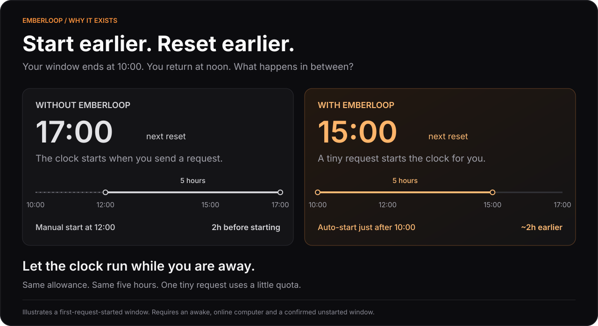
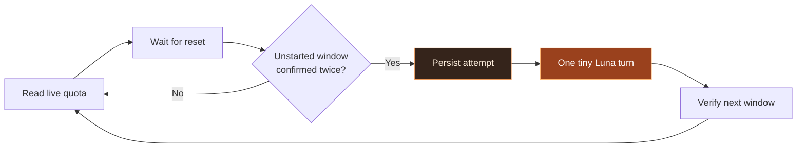

<p align="center">
  
</p>

<p align="center">
  <a href="https://github.com/abinzzz/emberloop/actions/workflows/tests.yml"></a>
  <a href="https://github.com/abinzzz/emberloop/releases"></a>
  <a href="https://github.com/abinzzz/homebrew-tap"></a>
  <a href="LICENSE"></a>
</p>

<p align="center">
  <strong>A small, local companion for your Codex five-hour windows.</strong><br>
  Watch the reset. Confirm the window. Send one tiny Luna turn.
</p>

<p align="center">
  <a href="#quick-start">Quick start</a> ·
  <a href="#the-loop">How it works</a> ·
  <a href="#small-by-design">Token usage</a> ·
  <a href="docs/usage.md">Reference</a> ·
  <a href="README.zh-CN.md">简体中文</a>
</p>

---

## Why Emberloop?

**Emberloop automatically starts an unstarted Codex five-hour window with a tiny request, so you do not have to remember to do it yourself.**



| | What you get |
|---|---|
| 🔥 **A tiny spark** | Luna, its lowest supported reasoning effort, and a request to reply with `1`. |
| ⏱ **Server-led timing** | Live reset timestamps, a short buffer, and two observations before starting. |
| 🪶 **A small footprint** | Python standard library only. Reuses your existing Codex ChatGPT login. |
| 🔒 **No repeat storm** | Process locking and a durable five-hour cooldown after every attempt. |
| 🍺 **A familiar workflow** | Homebrew install, foreground mode, or a background service. |

> [!NOTE]
> Emberloop starts **confirmed unstarted** windows. It does not add quota, reset active windows, or redeem reset credits. Window detection follows observed backend behavior, not a guaranteed OpenAI contract.

## Quick start

### 1 · Install

```sh
brew install abinzzz/tap/emberloop
```

You need a recent [Codex CLI](https://github.com/openai/codex), a ChatGPT login, access to GPT-5.6 Luna, and an account exposing a five-hour quota window. Homebrew installs Python for you. macOS and Linux are covered by CI; Windows is not currently supported.

### 2 · Check your window

```sh
codex login                 # Skip if already signed in
emberloop status
emberloop run --dry-run
```

`status` and `--dry-run` read metadata without generating model tokens.

### 3 · Keep the loop running

```sh
brew services start emberloop
```

That's it. Installing alone does not start the service. Your computer must be awake and online for a request to run.

<details>
<summary><strong>Service controls & foreground mode</strong></summary>

```sh
brew services info emberloop
brew services stop emberloop

# Or keep it in your terminal:
emberloop watch
```

Run the service as your user, without `sudo`. For custom `CODEX_HOME` or a custom Codex executable, use foreground mode or your own service environment. See the [full reference](docs/usage.md).

</details>

## The loop



An unused window whose reset time moves with the clock is a candidate. A window with a fixed reset time is already active—even if usage rounds to 0%. Emberloop checks again before dispatch, waits for a completed response, and then verifies that the new reset time is stable.

If a request fails or its outcome is uncertain, the attempt remains recorded. No automatic retry for five hours.

## Small by design

The default **direct** transport sends no tool definitions, conversation history, or project files. The optional **CLI** transport uses the native Codex harness with reduced context.

Observed local requests with Luna and `low`, September 8–9, 2026:

| Transport | Input tokens | Output tokens¹ | Total |
|---|---:|---:|---:|
| **Direct · sample 1** | **16** | **5** | **21** |
| **Direct · sample 2** | **16** | **19** | **35** |
| Native CLI · sample | 9,651 | 5 | 9,656 |

¹ Output includes reasoning: the second direct sample used 12 reasoning tokens. Counts vary between requests; these are observations, **not guaranteed minima or quota-percentage savings**. A single visible character can still cost several output tokens.

> [!IMPORTANT]
> The direct transport uses an **undocumented ChatGPT-backed endpoint** that may change. `--transport cli` is an explicit alternative with higher context overhead. Emberloop never silently switches to a more expensive model or transport.

## Commands at a glance

| Command | Purpose |
|---|---|
| `emberloop status` | Remaining quota and local reset dates |
| `emberloop status --json` | Machine-readable snapshot |
| `emberloop run --dry-run` | Check eligibility without a model turn |
| `emberloop run` | Check once; start only if eligible |
| `emberloop watch` | Monitor continuously |
| `emberloop watch --poll 60` | Reduce the maximum polling interval to 60 seconds |
| `emberloop watch --transport cli` | Use the native Codex harness |

`run` and `watch` can consume quota. Both require fresh live metadata; missing data is never treated as free capacity.

## Local by default

Credentials are read from your existing Codex login and are not stored in Emberloop logs. Direct requests go to the fixed ChatGPT-backed Codex endpoint, and redirects are refused. Scheduling state uses a hashed account identity.

The default polling interval is five minutes; a known earlier reset shortens the wait. After sleep or an offline period, Emberloop rechecks live state instead of replaying missed windows.

<details>
<summary><strong>Logs, state & upgrading from codex-window</strong></summary>

Service logs:

```sh
tail -f "$(brew --prefix)/var/log/emberloop.log"
```

Errors are written to `emberloop.error.log` in the same directory. Foreground mode emits JSON events.

To preserve duplicate-request protection, Emberloop retains the original state location:

- macOS: `~/Library/Application Support/codex-window`
- Linux: `$XDG_STATE_HOME/codex-window` or `~/.local/state/codex-window`

The internal Python module and `CODEX_WINDOW_CODEX` environment variable also remain compatible. Use one runner and one state directory per account.

Upgrade from the old Homebrew package:

```sh
brew services stop codex-window
brew uninstall codex-window
brew install abinzzz/tap/emberloop
brew services start emberloop
```

Do not delete the state directory during migration. The Python package retains `codex-window` as a command alias; the new Homebrew formula provides the `emberloop` command.

</details>

## Contributing

Bug reports and focused pull requests are welcome. Include your OS, Codex version, command, and redacted error; never attach authentication files or tokens.

```sh
git clone https://github.com/abinzzz/emberloop.git
cd emberloop
python3 -m unittest discover -s tests -v
python3 -m pip install .
emberloop --help
```

Tests simulate window transitions, stale snapshots, failed streams, account changes, and duplicate prevention. They do not use real credentials or send model requests.

Read the [reference](docs/usage.md) for operational details and the [changelog](CHANGELOG.md) for releases.

## Acknowledgments

Inspired by [onWatch](https://github.com/onllm-dev/onWatch)'s window detection and [codex-shift](https://github.com/alexiiio/codex-shift)'s minimal initialization approach. Built around the [Codex app-server protocol](https://learn.chatgpt.com/docs/app-server).

[MIT licensed](LICENSE) · Independent community project · Not affiliated with OpenAI

<p align="center"><sub>Keep the ember. Let the next cycle begin.</sub></p>
