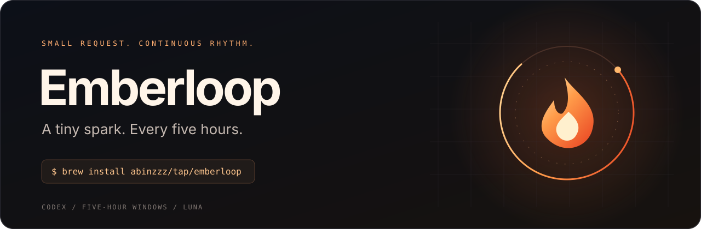
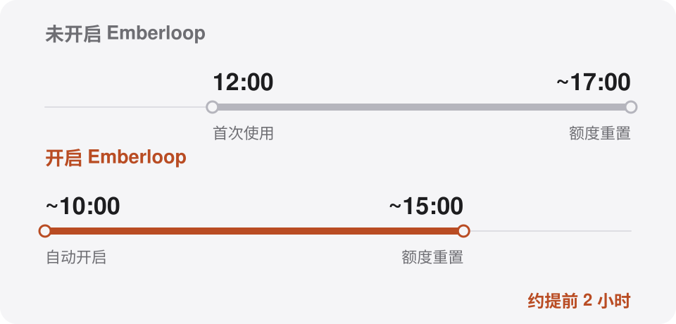

<p align="center">
  <picture>
    <source media="(prefers-color-scheme: dark)" srcset="assets/hero.dark.svg">
    
  </picture>
</p>

<h3 align="center">轻轻点火，让重置早一点。</h3>

<p align="center">
  用一次极小请求，自动开启尚未启动的 Codex 五小时额度窗口。<br>
  配置一次，让下一轮自然开始。
</p>

<p align="center">
  <a href="#快速开始">快速开始</a> &nbsp;·&nbsp;
  <a href="#一轮如何开始">工作原理</a> &nbsp;·&nbsp;
  <a href="docs/usage.md">完整参考</a> &nbsp;·&nbsp;
  <a href="README.md">English</a>
</p>

<br>

## 额度不变，早一点开始。

上一轮结束后，新的五小时窗口可能一直等到你发出请求才开始计时。Emberloop 会识别这个状态，自动完成首次请求，让下一次重置更早到来。

<picture>
  <source media="(prefers-color-scheme: dark) and (max-width: 600px)" srcset="assets/why-emberloop.zh.mobile.dark.svg">
  <source media="(max-width: 600px)" srcset="assets/why-emberloop.zh.mobile.svg">
  <source media="(prefers-color-scheme: dark)" srcset="assets/why-emberloop.zh.dark.svg">
  
</picture>

*例如：上一窗口在 10:00 结束。随后自动开启新窗口，而非等到中午首次使用，下一次重置就会从约 17:00 提前至约 15:00。*

Emberloop 只启动已确认尚未开始、且未使用的窗口。它不会增加额度、重置活动窗口或兑换重置券。窗口识别基于已观察到的服务端行为，并非 OpenAI 保证不变的接口约定。

<br>

## 快速开始

需要较新的 [Codex CLI](https://github.com/openai/codex)、ChatGPT 登录、GPT-5.6 Luna 访问权限，以及带有五小时额度窗口的账户。Homebrew 会安装 Python。CI 覆盖 macOS 和 Linux；目前不支持 Windows。

### 01 &nbsp; 安装

```sh
brew install abinzzz/tap/emberloop
```

### 02 &nbsp; 看看当前窗口

```sh
codex login                 # 已登录可跳过
emberloop status
emberloop run --dry-run
```

`status` 和 `--dry-run` 只读取元数据，不请求模型生成内容。

### 03 &nbsp; 开启后台服务

```sh
brew services start emberloop
```

仅安装不会自动启动服务。电脑需处于唤醒且联网状态，才能执行请求。

<details>
<summary>服务管理与前台运行</summary>

```sh
brew services info emberloop
brew services stop emberloop

# 也可以留在终端前台运行：
emberloop watch
```

以当前用户运行服务，不使用 `sudo`。如需自定义 `CODEX_HOME` 或 Codex 可执行文件，请使用前台模式或自行配置服务环境，详见[完整参考](docs/usage.md)。

</details>

<br>

## 小到刚刚好。

**一句极短回复。** 使用 Luna 及其最低支持的推理档，只要求回复 `1`。默认直接请求不携带工具定义、对话历史或项目文件。

**无需额外运行时包。** 仅依赖 Python 标准库，沿用现有 Codex 的 ChatGPT 登录，无需 API key。

**每次尝试都有记录。** 进程锁防止共享状态的实例重叠运行；发送前先保存记录。失败或结果不确定时，五小时内不自动重试。

### 实际用了多少 tokens？

2026 年 9 月 8–9 日，Luna + `low` 的本地实测：

| 方式 | 输入 | 输出¹ | 合计 tokens |
|---|---:|---:|---:|
| 直接请求 · 样本 1 | 16 | 5 | **21** |
| 直接请求 · 样本 2 | 16 | 19 | **35** |
| 原生 CLI · 样本 | 9,651 | 5 | **9,656** |

¹ 输出包含推理 tokens；第二个直接请求样本含 12 个推理 tokens。实际用量会波动，这些样本不是理论最低值，也不能直接换算为五小时或每周额度的下降比例。可见回复只有一个字符，也可能产生多个输出 tokens。

> [!IMPORTANT]
> 默认直接请求使用**尚未公开的 ChatGPT 后端接口**，后续可能需要适配。可显式选择 `--transport cli`，使用已缩减上下文的原生 Codex，但输入开销仍更高。Emberloop 不会自动切换到更贵的模型或请求方式。

<br>

## 一轮如何开始

1. **读取。** 获取实时额度，跟随服务端重置时间。
2. **确认。** 用两次查询，确认未使用的窗口确实尚未启动。
3. **开启。** 先保存尝试记录，再发送一次极短 Luna 请求，等待完整响应。
4. **验证。** 检查新的重置时间是否固定，然后等待下一轮。

未使用窗口的重置时间随时钟移动，且始终接近五小时后，才会成为候选。**如果重置时间固定，即使用量显示 0%，也属于已启动窗口。** 缺少实时数据时，不会假定有可用额度。

默认最大查询间隔为五分钟；已知重置时间更近时，会提前检查。睡眠或断网后会重新获取状态，不会补发错过的历史窗口。

## 常用命令

| 命令 | 作用 |
|---|---|
| `emberloop status` | 查看剩余额度和本地时区的重置时间 |
| `emberloop status --json` | 获取 JSON 状态 |
| `emberloop run --dry-run` | 只检查，不发送模型请求 |
| `emberloop run` | 检查一次，仅符合条件时发送 |
| `emberloop watch` | 持续监控 |
| `emberloop watch --poll 60` | 将最大查询间隔设为 60 秒 |
| `emberloop watch --transport cli` | 使用原生 CLI 方式 |

`run` 和 `watch` 可能消耗额度，两者都需要最新的实时元数据。

<br>

## 还有一些实用细节。

认证信息来自现有 Codex 登录，不会写入 Emberloop 日志。直接请求仅发往固定的 ChatGPT 后端 Codex 接口，并拒绝重定向。调度状态使用经过哈希处理的账户标识。

<details>
<summary>日志与本地状态</summary>

```sh
tail -f "$(brew --prefix)/var/log/emberloop.log"
```

错误日志为同目录下的 `emberloop.error.log`，前台模式输出 JSON 事件。

为保留防重复请求记录，Emberloop 沿用原有状态目录：

- macOS：`~/Library/Application Support/codex-window`
- Linux：`$XDG_STATE_HOME/codex-window` 或 `~/.local/state/codex-window`

同一账户请只运行一个实例，并使用同一个状态目录。

</details>

<details>
<summary>从 codex-window 升级</summary>

```sh
brew services stop codex-window
brew uninstall codex-window
brew install abinzzz/tap/emberloop
brew services start emberloop
```

**保留原有状态目录**，避免丢失防重复触发记录。内部 Python 模块名和 `CODEX_WINDOW_CODEX` 环境变量保留兼容。Python 包仍提供 `codex-window` 命令别名；新的 Homebrew 包使用 `emberloop` 命令。

</details>

<details>
<summary>开发与贡献</summary>

欢迎提交问题和聚焦明确的 PR。请附上操作系统、Codex 版本、执行命令及脱敏后的错误，不要上传认证文件或 token。

```sh
git clone https://github.com/abinzzz/emberloop.git
cd emberloop
python3 -m unittest discover -s tests -v
python3 -m pip install .
emberloop --help
```

测试模拟窗口状态、过期快照、失败响应、账户切换及重复请求保护，不读取真实凭证，也不调用模型。

</details>

<br>

---

灵感来自 [onWatch](https://github.com/onllm-dev/onWatch) 和 [codex-shift](https://github.com/alexiiio/codex-shift)，基于 [Codex app-server 协议](https://learn.chatgpt.com/docs/app-server)构建。

[完整参考（英文）](docs/usage.md) &nbsp;·&nbsp; [更新记录](CHANGELOG.md) &nbsp;·&nbsp; [版本发布](https://github.com/abinzzz/emberloop/releases) &nbsp;·&nbsp; [测试状态](https://github.com/abinzzz/emberloop/actions/workflows/tests.yml) &nbsp;·&nbsp; [MIT 许可证](LICENSE)

<sub>独立社区项目，与 OpenAI 无隶属关系。</sub>
